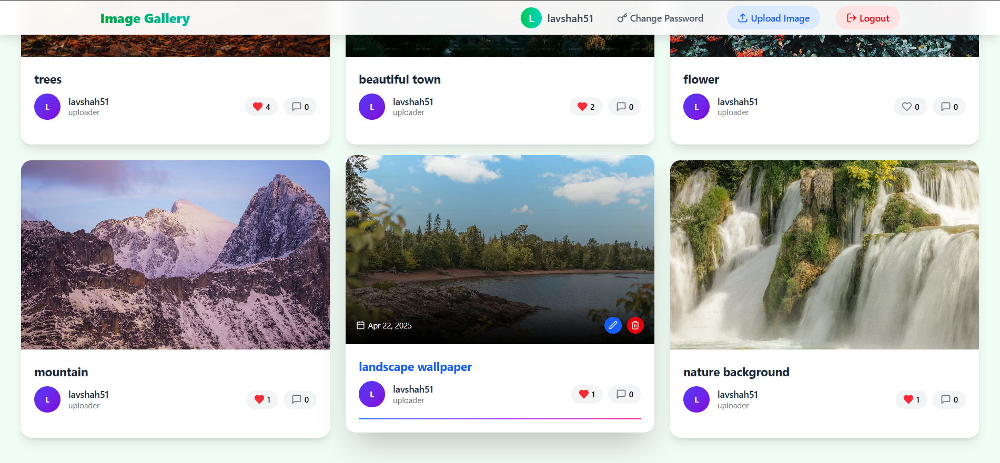
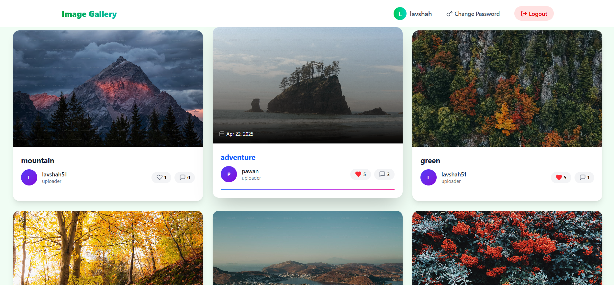

# 📸 Image Gallery App

A full-stack image gallery web application built with the **MERN stack** (MongoDB, Express, React, Node.js). Users can register, log in, upload images (admin only), like photos, and leave comments.

## 📷 Demo Admin



## 📷 Demo user



## 🚀 Features

- 🔐 **Authentication**
  - User registration and login (JWT-based)
  - Role-based access (Admin can upload images)
  
- 🖼️ **Image Gallery**
  - View all uploaded images
  - Admin-only image uploads
  - Cloudinary for image storage

- 💬 **Comments & Likes**
  - Comment on images
  - Like/unlike functionality
  - Real-time UI updates

- ✏️ **Editing & Deleting**
  - Delete your own comments
  - Admin can edit image titles

## 🧰 Tech Stack

### Frontend
- React
- Axios
- React Router
- Tailwind CSS

### Backend
- Node.js + Express
- MongoDB + Mongoose
- Cloudinary (image hosting)
- Bcrypt (password hashing)
- JSON Web Token (JWT)

## ⚙️ Setup Instructions

### 🔧 Backend

```bash
cd backend
npm install
# Create a .env file with:
# MONGO_URI=your_mongodb_uri
# JWT_SECRET=your_secret_key
# CLOUDINARY_CLOUD_NAME=your_cloud_name
# CLOUDINARY_API_KEY=your_api_key
# CLOUDINARY_API_SECRET=your_api_secret

npm run dev


💻 Frontend
cd client
npm install
npm start

📁 Folder Structure
/
├── client/
│   └── React app
├── backend/
│   ├── router/
│   ├── controllers/
│   ├── models/
│   └── middleware/


🧑‍💻 Author
Lav shah

📝 License
This project is licensed under the MIT License.


